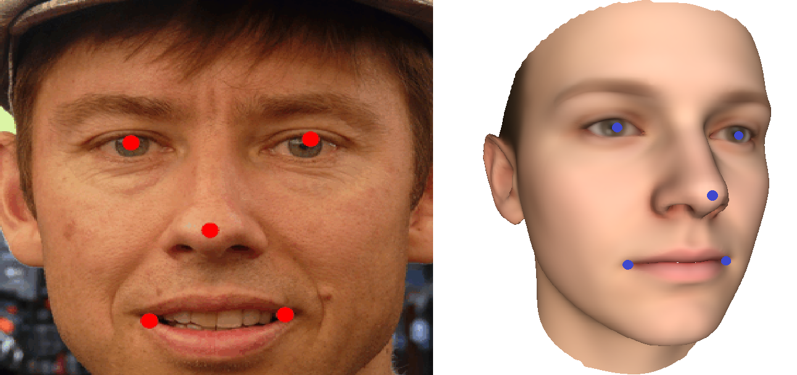
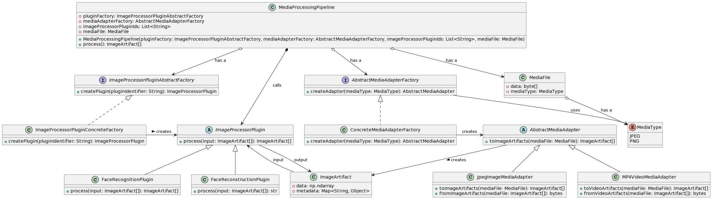
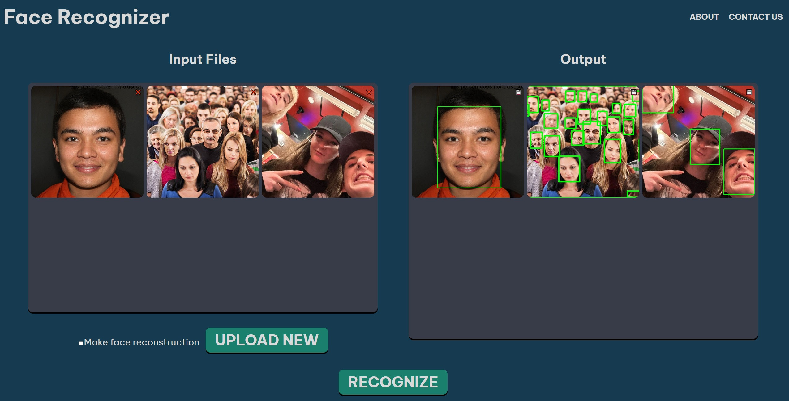
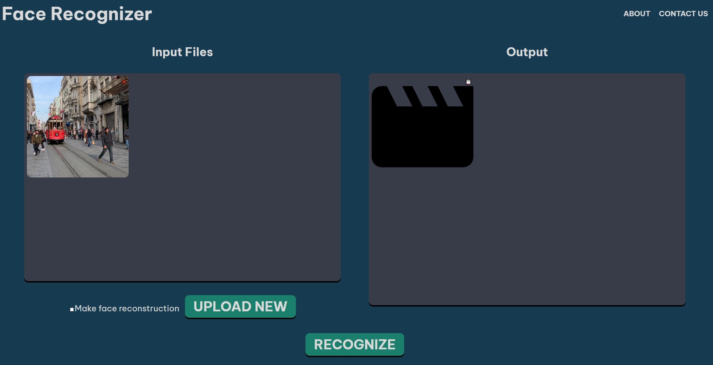
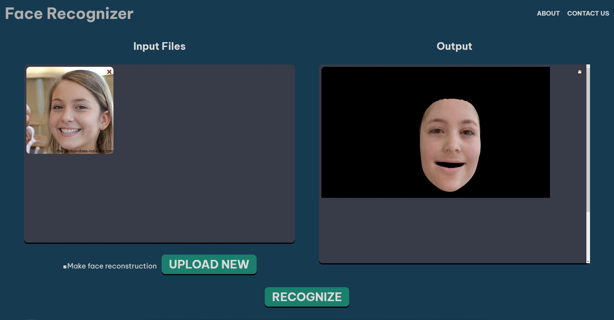

# Опис проекту
Проект був запропонований для розробки доцентом кафедри прикладної математики команді, яка складалася з групи студентів ПМПМ-12.

Суть проекту полягала в тому, щоб на зображеннях та відео розпізнати обличчя та застосувати окремі функції до вхідних даних (для прикладу – реконструкція обличчя). Також проект мусить бути добре масштабованим для подальших поколінь команд, які будуть займатися проектом.
Оскільки наша команда є першою, яка прийняла завдання та створила цей проект – ми побудували початкову масштабовану структуру, реалізували розпізнавання обличчя використовуючи YOLO V8 та 3D-реконструкцію обличчя завдяки Deep3DFaceReconstruction від Microsoft.

# Реалізований функціонал
В проекті реалізована початкова добре масштабована архітектура проекту, яка дозволить майбутнім студентам, які працюють над проектом легко додавати новий функціонал. (дивитись діаграму класів)
Реалізовано розпізнавання обличчя з одного або декілька фото формату __.jpg__ та відео формату __.mp4__ за допомогою нейронної мережі ultralytics YOLOv8, яка була власноруч натренована на датасеті з обличчями людей [Open Google dataset v7](https://storage.googleapis.com/openimages/web/visualizer/index.html?type=detection&set=train&c=%2Fm%2F0dzct). Навчання нейронної мережі відбувалося в 100 епох на RTX 3080Ti та тривало приблизно тиждень. Доступна функція завантаження розпізнаних фото та відео і файлу формату __.obj__ (розширений формат файлу .obj з підтримкою RGB кольорів для кожної точки).

Була здійснена реалізація 3D реконструкції обличчя завдяки проекту Deep3DFaceReconstruction від Microsoft. Ця бібліотека на вхід потребує саме зображення потрібної людини. Далі за допомогою встановленої бібліотеки MTCNN, яка виявляє обличчя на фотографії, відбувається визначення координат точок-орієнтирів на обличчі. Точки ставляться на очах, кінцях роту та одна точка на носі. 

Це потрібно для того, щоб виконати попереднє вирівнювання зображення. На етапі попередньої обробки зображення ми розв'язуємо задачу найменших квадратів між 5 орієнтирами обличчя на зображенні та 5 орієнтирами середнього 3D-обличчя BFM09, щоб нівелювати масштаби обличчя та розбіжності.  Однак використаний нами 2D-детектор може повертати неправильні орієнтири під великими позиціями, що може вплинути на результат вирівнювання.

Зараз розпізнавання обличчя реалізовано на CPU, щоб перемкнути його на GPU потрібно:
1. У файлі, що знаходиться `./Source/WebApi/venv/business_layers/plugins/face_recognition_plugin.py` в стрічці 22 потрібно замінити значення параметру device на "gpu";
2. Поставити PyTorch версії 1.10;
3. Поставити зовнішній пакет CUDA та CUDNN відповідних версій які будуть підходити до Вашої відеокарти і до цієї версії PyTorch.

# Запуск проекту
## Підготовка до запуску
Необхідні файли знаходяться в архіві `BigFiles.zip` (файли BigFiles.z0i, де i=1-4 це як частина того архіву). Файли 01_MorphableModel).mat та BFM_model_front.mat потрібно помістити у папку `./Source/WebApi/venv/business_layers/plugins/reconstruction/BFM`. 

Також потрібно замінити файл best.pt на його варіант з архіву в директорії: 

`ObjectRecognition-develop\Source\WebApi\venv\business_layers\plugins`
 
Так було зроблено, оскільки GitHub має обмеження на завантаження файлу в 100 Мегабайт.
## Запуск Back-End
`pip install -r requirements.txt`

`python app.py`
## Запуск Front-End
Встановити Angular

`npm install -g @angular/cli`

`npm install --save-dev @angular-devkit/build-angular`

### Складання проекту
Запустити команду `ng build` для того, щоб збілдити проект. Артефакти білду будуть зберігатися в папці `dist/`

### Сервер розробки
Запустити команду `ng serve` для дев серверу. Перейти за адресою `http://localhost:4200/`. Аплікація автоматично буде перезапускатися при зміні будь-якого сорс файлу. Якщо у вас виникли проблеми з брейкпоїнтами у VSCode, додайте `--host 127.0.0.1` до команди `serve`.

# Діаграма класів в проекті

# Використані технології
## Python версії 3.10 і більше та його пакети:
-	Flask;
-	Numpy;
-	Ultralytics;
-	OpenCV;
-	Tensorflow версії 2 і більше;
-   PyTorch
## Basel Face Model
## Node.js версії 18
## Angular

# Перспективи розвитку проекту
- Використання новішої моделі BFM для 3Д-риконструкції обличчя(Поточна модель 2009 року, остання існуюча 2019 року). 
- Розробка нових методів для вирішення проблем з обробкою мультимедійних даних
- Підвищення стійкості до шумів
- Розпізнавання нових об'єктів
- Міграція Tensorflow 1 коду до Tensorflow 2
- Налаштувати розпізнавання обличчя за допомогою GPU. Поточне розпізнавання відбувається на CPU
- Реалізувати Docker-контейнер

# Перспективи розвитку проекту
## Приклад роботи розпізнавання з фото 

## Приклад роботи розпізнавання з відео

## Приклад роботи 3D-реконструкції

